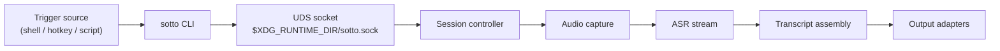

# sotto

[](https://github.com/rbright/sotto/actions/workflows/ci.yml)

Local-first CLI for automated speech recognition (ASR).

`sotto` captures microphone audio, streams it to a local ASR backend, assembles transcript text, and can optionally route output to clipboard/paste adapters.

- No daemon/background service.
- Single binary runtime.
- Built for local-first automation workflows.

## Features

- `toggle` / `stop` / `cancel` command flow for dictation sessions
- single-instance runtime coordination via unix socket
- local audio capture via PipeWire/Pulse
- streaming ASR via local NVIDIA Riva gRPC endpoint
- transcript normalization with optional trailing space
- output adapters: clipboard + optional paste dispatch (command or configurable shortcut)
- session diagnostics via `sotto doctor`
- JSONL session logs for observability/debugging

## Requirements

Core runtime dependencies:

- local ASR service endpoint (default: NVIDIA Riva)
- local audio backend compatible with PipeWire/Pulse

Adapter/tool dependencies (when enabled by config):

- clipboard command (default: `wl-copy`)
- paste/notification adapter commands (for your environment)

> `sotto` is local-first by default. No cloud ASR endpoint is required by design.

## Installation

### Nix (recommended)

```bash
nix build 'path:.#sotto'
nix run 'path:.#sotto' -- --help
```

### From source

```bash
just tools
go test ./apps/sotto/...
go build ./apps/sotto/cmd/sotto
```

## Quickstart

```bash
sotto doctor
sotto toggle   # start
sotto toggle   # stop + commit
```

Core commands:

```bash
sotto toggle
sotto stop
sotto cancel
sotto status
sotto devices
sotto doctor
sotto version
```

## Architecture

High-level architecture docs and diagrams:

- [Architecture overview](./docs/architecture.md)
- [Modularity review + refactor slices](./docs/modularity.md)



## Configuration

Path resolution order:

1. `--config <path>`
2. `$XDG_CONFIG_HOME/sotto/config.conf`
3. `~/.config/sotto/config.conf`

Detailed reference:

- [Configuration reference](./docs/configuration.md)

## Verification

Build/test gate:

```bash
just ci-check
nix build 'path:.#sotto'
```

Optional integration-tag tests (local machine resources):

```bash
just test-integration
```

Local runtime smoke helpers:

```bash
just smoke-riva-doctor
just smoke-riva-manual
```

Full checklist:

- [Verification guide](./docs/verification.md)

## References

- PipeWire: https://pipewire.org/
- NVIDIA Riva: https://developer.nvidia.com/riva
- NVIDIA Parakeet models on Hugging Face: https://huggingface.co/models?search=nvidia%20parakeet
