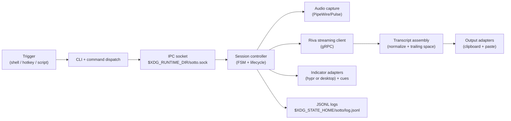
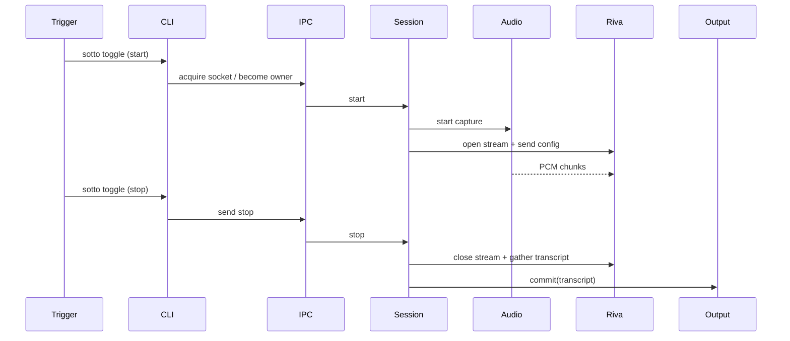

# Architecture

`sotto` is a local-first ASR CLI with clear boundaries between state logic and side-effect adapters.

## Component map

## Package responsibilities

| Package | Responsibility |
| --- | --- |
| `internal/cli` | command/flag contract |
| `internal/app` | top-level wiring and dispatch |
| `internal/ipc` | single-instance socket lifecycle + forwarding |
| `internal/fsm` | legal session transitions |
| `internal/session` | lifecycle orchestration (`toggle`/`stop`/`cancel`) |
| `internal/audio` | device discovery/selection + capture stream |
| `internal/riva` | ASR stream transport + response accumulation |
| `internal/pipeline` | audio-to-ASR bridge + debug artifacts |
| `internal/transcript` | text normalization and assembly |
| `internal/output` | clipboard + paste adapters |
| `internal/indicator` | visual indicator + cue sound dispatch |
| `internal/doctor` | environment/readiness checks |
| `internal/logging` | session log bootstrap |

## Runtime flow (`toggle` -> `toggle`)

## Platform coupling (today)

Current production path is Wayland + Hyprland:

- default paste path calls `hyprctl sendshortcut`
- doctor checks require Hyprland session context

This coupling is intentionally explicit and isolated in `internal/hypr` + output/doctor adapters so additional desktop targets can be added without changing session/FSM logic.
