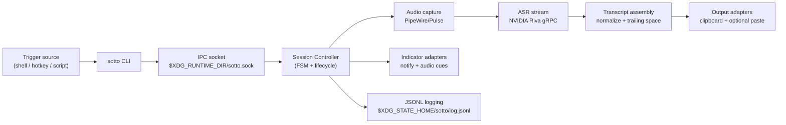
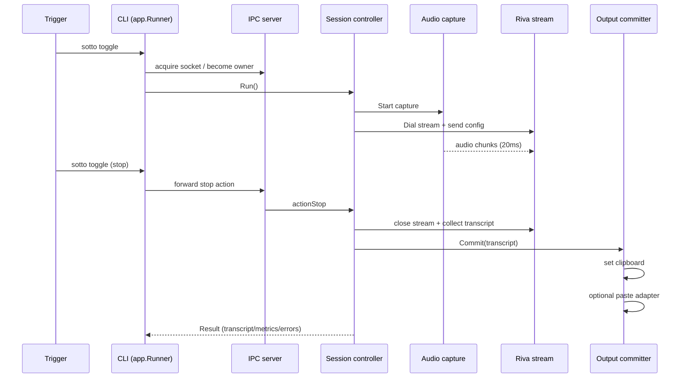
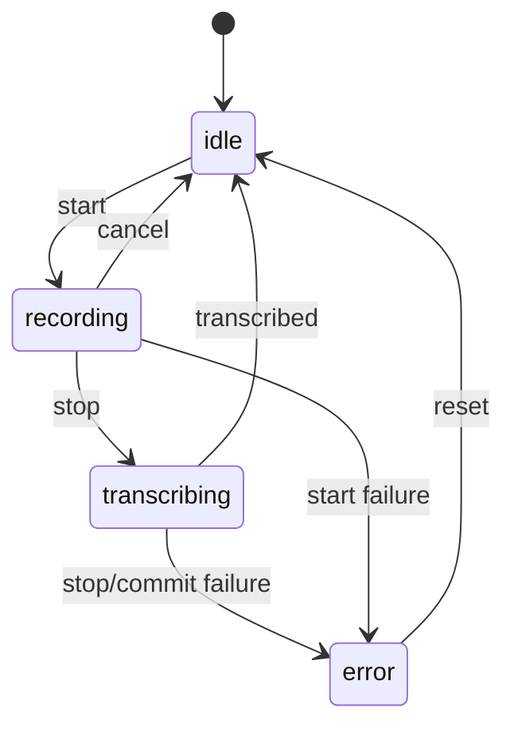

# sotto Architecture

`sotto` is a local-first ASR CLI with explicit component boundaries so behavior can be tested mostly in-process.

## 1) High-level component map

## 2) Package responsibilities

| Package | Responsibility |
| --- | --- |
| `internal/cli` | Parse command/flag contract |
| `internal/app` | Top-level execution and dispatch wiring |
| `internal/ipc` | Single-instance socket ownership + command forwarding |
| `internal/session` | Dictation lifecycle orchestration and FSM transitions |
| `internal/audio` | Device discovery/selection + capture chunk stream |
| `internal/riva` | gRPC stream setup + ASR response accumulation |
| `internal/pipeline` | Bridge audio capture to ASR + debug artifact handling |
| `internal/transcript` | Segment assembly/whitespace normalization |
| `internal/output` | Clipboard and paste adapters |
| `internal/indicator` | Notification and cue adapters |
| `internal/doctor` | Environment/config/tool/readiness diagnostics |
| `internal/logging` | Runtime JSONL log setup |

## 3) Runtime flow (toggle -> stop)

## 4) Session state model

## 5) External dependencies

- [PipeWire](https://pipewire.org/) for local audio capture backend
- [NVIDIA Riva](https://developer.nvidia.com/riva) for local ASR serving
- [NVIDIA Parakeet model family on Hugging Face](https://huggingface.co/models?search=nvidia%20parakeet)

## 6) Testing boundary policy

- Prefer real adapters/resources (temp files, unix sockets, `httptest`, PATH fixtures).
- Avoid mock frameworks for in-repo behavior.
- Full model inference remains local-manual verification (not CI).
